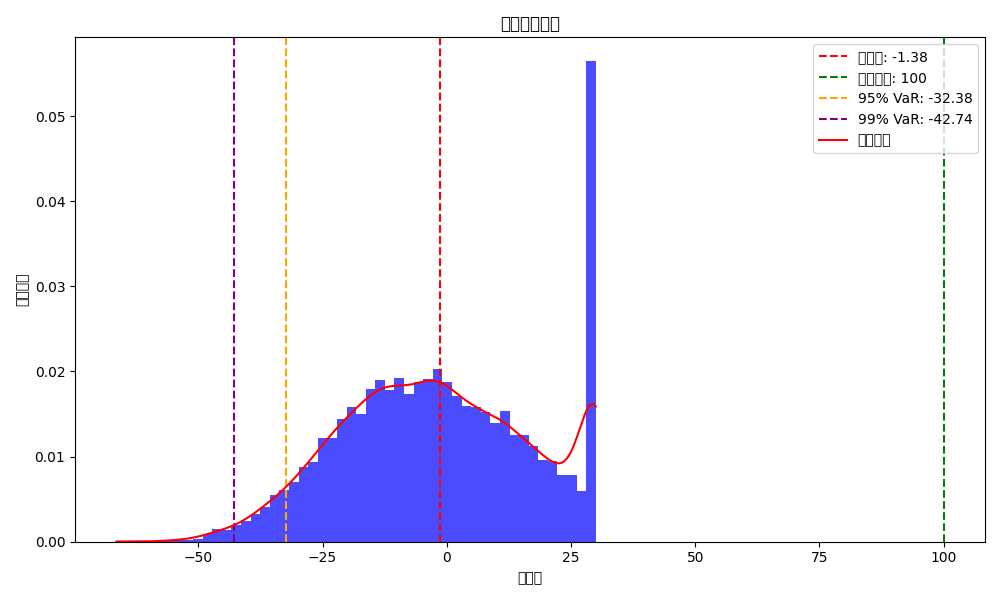
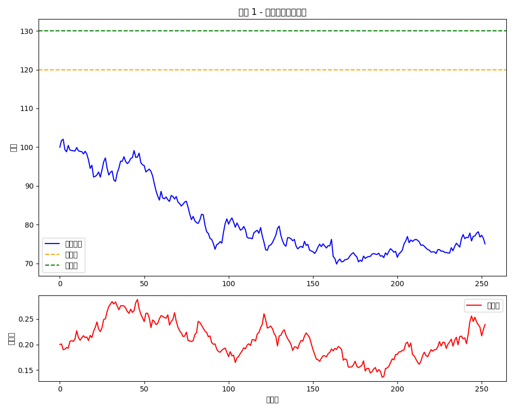

# 📊 Adaptive Margin-Control Note (AMCN)

[](https://github.com/yourusername/structured-1400)
[](LICENSE.md)
[](https://github.com/yourusername/structured-1400)

<p align="center">
  
</p>

## 🌟 Project Overview

The Adaptive Margin-Control Note (AMCN) is an innovative structured derivative product that combines path-dependent features, a dynamic margin control system, and a reserve pool mechanism to offer investors:

- 💹 **Upside Market Participation**: Retain significant exposure to market gains.
- 🛡️ **Downside Risk Mitigation**: Provide risk protection through a unique reserve pool mechanism.
- 🔄 **Adaptive Risk Control**: Automatically adjust risk exposure based on market trends.
- 🎮 **User-Controlled Mechanisms**: Allow investors to intervene and manage risks actively.

This product is particularly suited for high-volatility market environments, offering intelligent structural design that balances upside potential with downside risk management.

## 🔍 Core Mechanisms

### Knock-In and Payout Cap
When the underlying asset's return exceeds 20%, the payout cap mechanism (30%) is triggered, transferring excess returns to the reserve pool.

### Reserve Pool Protection
The reserve pool stores excess returns and automatically replenishes margin or allows user-directed replenishment during equity drawdowns, preventing forced liquidation.

### Margin Control System
Initial margin (10%) and maintenance margin (5%) thresholds are set. If equity falls below the maintenance margin and the reserve pool is depleted, a knock-out event is triggered.

<details>
<summary><b>View Detailed Product Structure</b></summary>
<p align="center">
  
</p>
</details>

## 📈 Simulation Results

Key findings from advanced Monte Carlo simulations (10,000 paths, incorporating jump diffusion and stochastic volatility):

| Metric | Value |
|--------|-------|
| Theoretical Note Value | ¥-1.38 |
| Initial Principal | ¥100.00 |
| Payout Cap | 30% |
| Knock-In Threshold | 20% |
| Maintenance Margin | 5% |
| 95% Value at Risk (VaR) | -32.38 |
| 99% Value at Risk (VaR) | -42.74 |
| Conditional Value at Risk (CVaR) | -38.78 |
| Average Maximum Drawdown | 27.64% |
| Knock-In Probability | 33.43% |
| Forced Liquidation Probability | 0% |

### Performance Highlights

- Provides stable returns in moderately bullish market conditions.
- Significantly reduces extreme loss risks in high-volatility markets.
- Effectively buffers market shocks through the reserve pool mechanism.
- Stochastic volatility modeling accurately reflects real market conditions.
- Offers investors flexibility for intervention and adjustments.

## 📚 Project Documentation

- [📄 **Term Sheet**](./term-sheet.md): Comprehensive product terms and specifications.
- [📋 **Whitepaper**](./whitepaper.md): Detailed product design philosophy and mechanisms.
- [⚠️ **Risk Disclosure**](./risk-disclosure.md): Explanation of product risks and suitability.
- [📊 **Scenario Examples**](./scenario-examples.md): Product performance under various market conditions.

## 💻 Technical Implementation

This project is implemented in Python, leveraging core technologies such as:

```python
# Example of core pricing logic
for i in tqdm(range(n_paths)):
    prices = [S0]
    volatilities = [sigma_base]
    current_sigma = sigma_base
    pool = 0
    knocked_in = False
    
    for t in range(N):
        # Update stochastic volatility (Heston-like)
        vol_shock = np.random.normal(0, 1)
        current_sigma = max(0.05, current_sigma + vol_mean_reversion * (vol_long_run_mean - current_sigma) * dt + 
                        vol_vol * np.sqrt(current_sigma * dt) * vol_shock)
        
        # Price diffusion and jumps
        z = np.random.normal()
        dS_diffusion = prices[-1] * (mu * dt + current_sigma * np.sqrt(dt) * z)
        
        jump_occurs = np.random.poisson(jump_intensity * dt)
        dS_jump = 0
        if jump_occurs > 0:
            jump_size = np.random.normal(jump_mean, jump_std, jump_occurs)
            dS_jump = prices[-1] * np.sum(jump_size)
        
        # ...Knock-In checks and risk control logic...
```

Full code available in [pricing_model.py](./pricing_model.py).

## 🚀 How to Use

1. **Clone the Repository**
   ```bash
   git clone https://github.com/yourusername/structured-1400.git
   cd structured-1400/Day001-Adaptive-Margin-Control-Note
   ```

2. **Install Dependencies**
   ```bash
   pip install numpy matplotlib pandas tqdm
   ```

3. **Run Simulations**
   ```bash
   python pricing_model.py
   ```

4. **View Results**
   - Simulation charts will be saved in the `simulation_charts/` directory.
   - Pricing results will be saved as `pricing_result.csv`.

## 🔗 Related Resources

- [Structured Product Design Series](https://github.com/yourusername/structured-1400)
- [Financial Derivatives Design Guide](https://github.com/yourusername/structured-1400)
- [Quantitative Finance Toolkit](https://github.com/yourusername/structured-1400)

## 👨‍💼 Author

This project is part of the structured derivatives design series, showcasing innovative applications of modern financial engineering. Suitable for:

- 🎓 Derivatives education and learning.
- 📝 Case studies in financial engineering.
- 💼 Portfolio showcase for interviews.
- 🧪 Experimental structured product design.

## 📄 License

This project is licensed under the [MIT License](./LICENSE.md). You are free to use, modify, and distribute this code, provided the original author attribution is retained.

---

<p align="center">
  <i>This is part of the structured-1400 series of structured derivative designs.</i><br>
  <a href="https://github.com/yourusername/structured-1400">Explore more innovative financial structures →</a>
</p>
