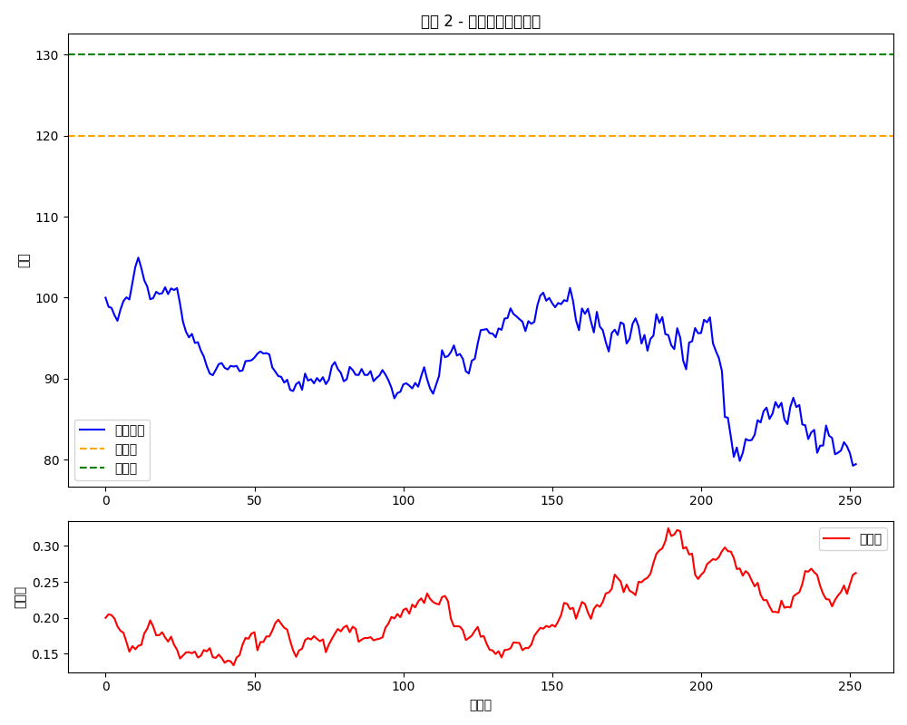

# Scenario Examples — Adaptive Margin-Control Note

---

## 🎯 Overview

The following illustrates the triggering logic, fund pool dynamics, and final yield behavior of the Adaptive Margin-Control Note under four typical market paths, accompanied by simulation images for better understanding.

---

## 📈 Scenario 1: Strong Uptrend → Knock-In → Yield Cap

- The underlying asset continues to rise, exceeding the +20% knock-in threshold.
- Returns exceeding +30% are capped and transferred to the fund pool.
- The client receives a +30% yield, and the fund pool accumulates for future margin replenishment.
- Simulation uses stochastic volatility: mean reversion speed κ=3.0, long-term mean θ=20%.

**Illustration:**

---

## 📉 Scenario 2: Uptrend Followed by Decline → Automatic Margin Replenishment → Position Sustained

- Initial rise exceeds +20%, triggering knock-in and fund pool accumulation.
- Random volatility changes lead to increased market fluctuations.
- Price drops close to the maintenance margin line (5%).
- The system automatically utilizes the fund pool for margin replenishment → avoids forced liquidation.
- Ultimately, the position is held until maturity, yielding post-recovery returns.

**Illustration:**

---

## ⚠️ Scenario 3: No Knock-In → Market Crash → Forced Liquidation

- The underlying asset's maximum growth does not exceed +20%, no knock-in.
- A sudden drop occurs (jump frequency λ=5, average jump size=-1%).
- Account equity falls below the maintenance margin (5%).
- Due to an empty fund pool → forced liquidation is triggered → structure terminates.

**Illustration:**

---

## 🛠️ Scenario 4: Knock-In Followed by Client-Initiated Margin Replenishment → Equity Preserved

- Early market rise triggers knock-in, accumulating the fund pool.
- Sudden volatility increase (volatility of volatility ξ=30%) leads to mid-term decline nearing risk zones.
- Client manually operates: injects funds from the pool for margin replenishment.
- Ultimately, termination is avoided, and the position is held until maturity.

**Illustration:**

---

## 🧠 Scenario Comparison Summary

| Scenario No. | Knock-In | Margin Replenishment | Termination | Client Outcome | Key Risk Factors |
|--------------|----------|----------------------|-------------|----------------|------------------|
| 1            | ✅ Yes   | ❌ No               | ❌ No       | Yield +30%, fund pool accumulates | Stable volatility |
| 2            | ✅ Yes   | ✅ Automatic        | ❌ No       | Yield preserved, termination avoided | Rising volatility |
| 3            | ❌ No    | ❌ None             | ✅ Yes      | Forced liquidation, residual settlement | Price jumps |
| 4            | ✅ Yes   | ✅ Manual           | ❌ No       | Full yield, successful defensive strategy | Sudden volatility |

---

📌 Images are generated via Python simulation, located in the `./simulation_charts/` folder. Parameters can be modified and regenerated using `pricing_model.py`.

