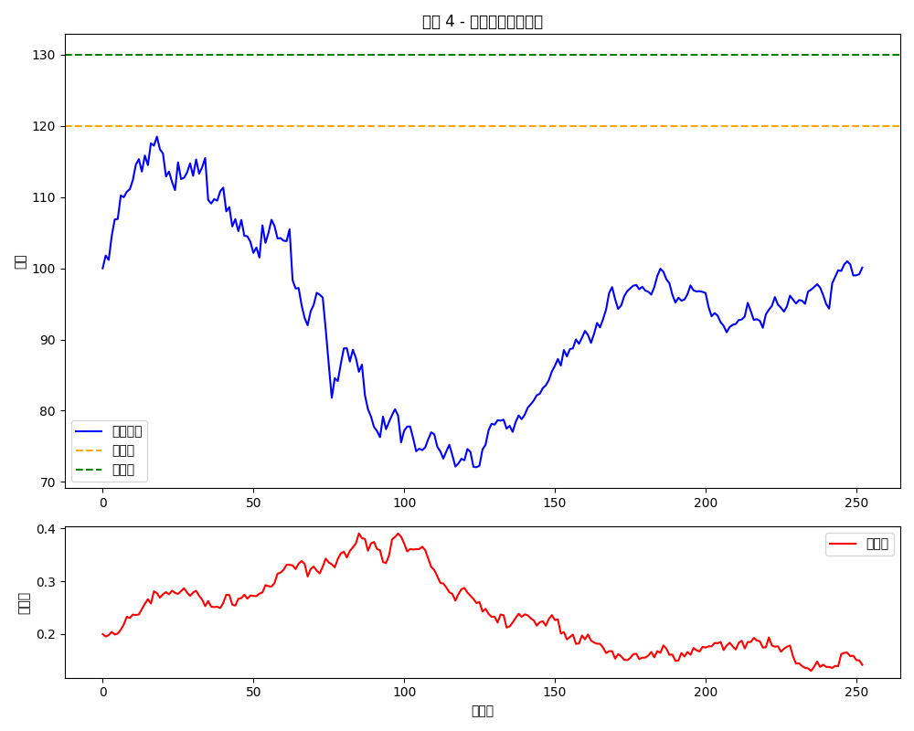

# Scenario Examples — Adaptive Margin-Control Note
**结构运行情境图文示例**

---

## 🎯 概述

以下展示 Adaptive Margin-Control Note 在 4 种典型市场路径下的触发逻辑、资金池动态与最终收益行为，结合模拟图像帮助理解结构行为。

---

## 📈 情景一：强势上涨 → 敲入 → 收益封顶

- 标的资产持续上涨，超过 +20% 敲入点
- 超过 +30% 的收益被封顶，转入资金池
- 客户获得 +30% 收益，资金池积累可用于未来补仓

**图示：**

---

## 📉 情景二：上涨后回落 → 自动补仓 → 持仓续命

- 起初上涨超过 +20%，敲入触发，积累资金池
- 后续价格下跌接近维持保证金线
- 系统自动调用资金池进行补仓 → 避免强平
- 最终仍持仓至到期，获得回升后的收益

**图示：**

---

## ⚠️ 情景三：未敲入 → 市场暴跌 → 爆仓终止

- 标的资产最高涨幅未超过 +20%，未敲入
- 后续暴跌，账户权益低于维持保证金
- 因无资金池可补仓 → 强平触发 → 结构终止

**图示：**

---

## 🛠️ 情景四：敲入后用户主动补仓 → 成功保留权益

- 市场前期上涨触发敲入，资金池积累
- 中途下跌接近风险区
- 客户主动操作：手动从池中注入资金补仓
- 最终未触发终止，持有至期满

**图示：**

---

## 🧠 情景对比小结

| 情景编号 | 是否敲入 | 是否触发补仓 | 是否终止 | 客户结果 |
|----------|----------|----------------|-------------|------------|
| 1        | ✅ 是    | ❌ 否         | ❌ 否       | 收益 +30%，资金池积累 |
| 2        | ✅ 是    | ✅ 自动       | ❌ 否       | 收益保留，避免终止 |
| 3        | ❌ 否    | ❌ 无池       | ✅ 是       | 强平爆仓，残值结算 |
| 4        | ✅ 是    | ✅ 手动       | ❌ 否       | 收益完整，策略防御成功 |

---

📌 图像由 Python 模拟产生，位于 `./simulation_charts/` 文件夹中。可配合 `pricing_model.py` 使用参数修改并重生成。

