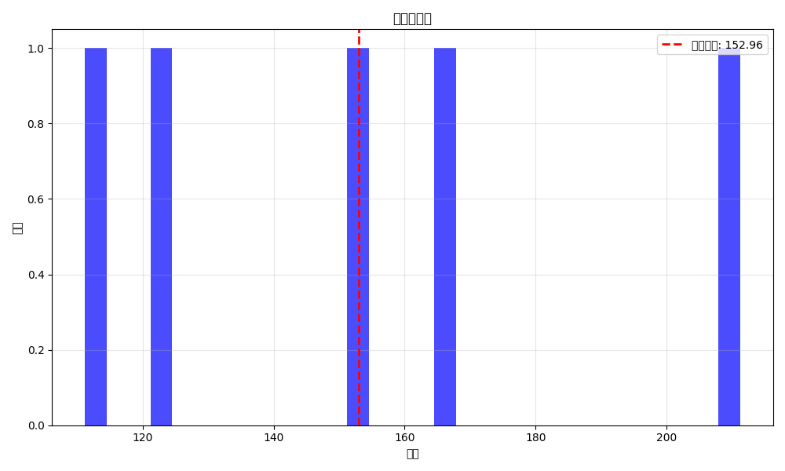
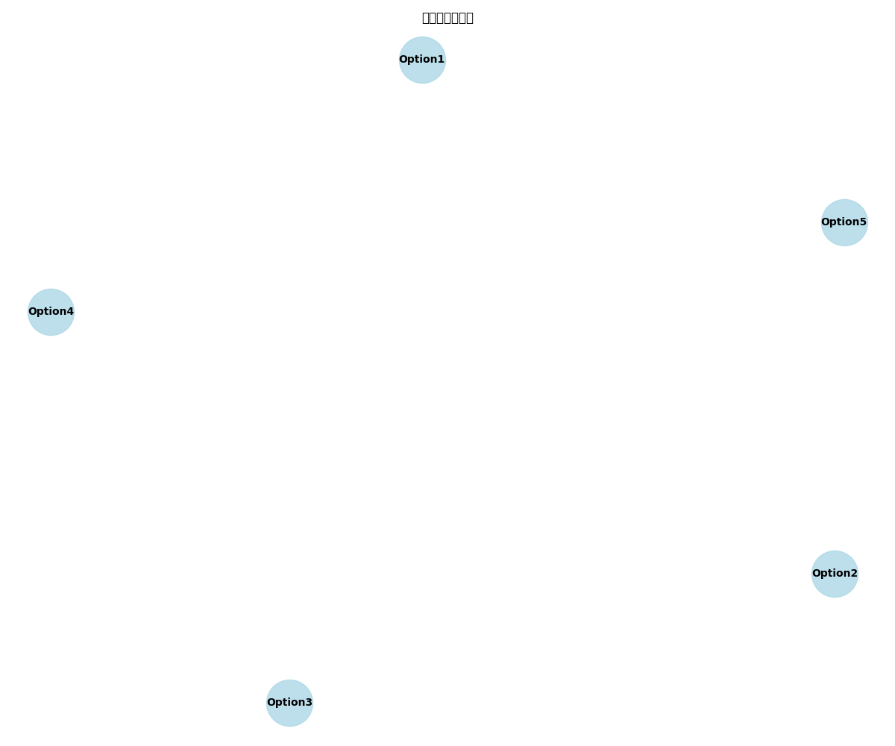
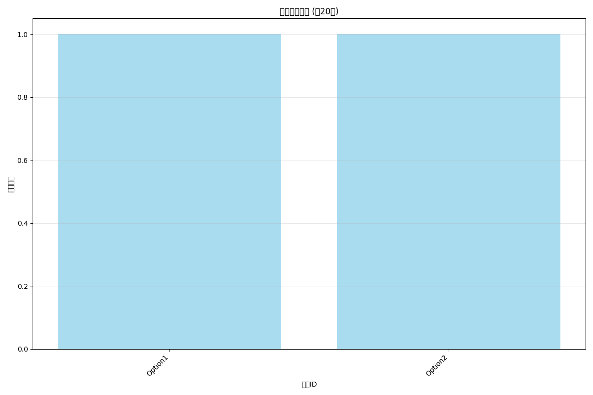

# 情景示例分析

本文档通过几个典型市场情景，展示结构化执行树算法如何确定最优执行策略。

## 情景一：单一资产上涨趋势

### 市场条件
- Asset1（如标普500指数）在模拟期间呈现稳定上涨趋势
- 其他资产价格相对稳定

### 最优执行序列
在此情景下，算法的最优执行序列通常为：

1. 首先执行与Asset1相关的看涨期权（美式）
2. 随后执行由这些期权触发的其他期权
3. 欧式期权会在接近到期日时执行

### 可视化结果

在这种情景下，收益分布呈现较高的期望值和较低的波动性。

## 情景二：多资产相关波动

### 市场条件
- 多个资产价格呈现高度相关的波动
- 价格走势没有明显趋势

### 最优执行序列
在此情景下，算法倾向于：

1. 等待市场出现明显方向性变化
2. 集中执行具有相同方向性暴露的期权
3. 充分利用期权之间的依赖关系优化执行顺序

### 依赖关系影响

此类情景下，期权之间的依赖关系对最终收益影响很大，算法会找到最佳的执行顺序。

## 情景三：市场震荡

### 市场条件
- 资产价格在一定区间内来回震荡
- 波动性较高但缺乏明确方向

### 最优执行序列
在此情景下，算法通常会：

1. 优先执行能够从波动性中获利的期权
2. 避免过早执行会禁用其他期权的选择权
3. 灵活调整执行时机以适应震荡市场

### 执行频率分析

在震荡市场中，期权的执行频率分布更加均匀，算法会更加灵活地适应市场变化。

## 情景四：极端市场事件

### 市场条件
- 某些资产价格出现跳跃式变化
- 资产间相关性在危机时刻显著提高

### 最优执行序列
在极端情景下，算法会采取以下策略：

1. 迅速执行能够对冲风险的期权
2. 集中执行受益于市场急剧变化的期权
3. 优先考虑确定性收益而非潜在高收益的机会

### 风险管理效果
在极端市场事件下，结构化执行树算法能够显著降低损失，并可能将危机转化为获利机会。

## 综合分析

通过对比不同市场情景下的执行策略，我们可以得出以下结论：

1. 结构化执行树算法能够适应各种市场环境
2. 期权之间的依赖关系对最优执行顺序有显著影响
3. 算法的价值在市场波动较大时更为明显
4. 相比简单的执行策略，本算法可以显著提高收益或降低风险